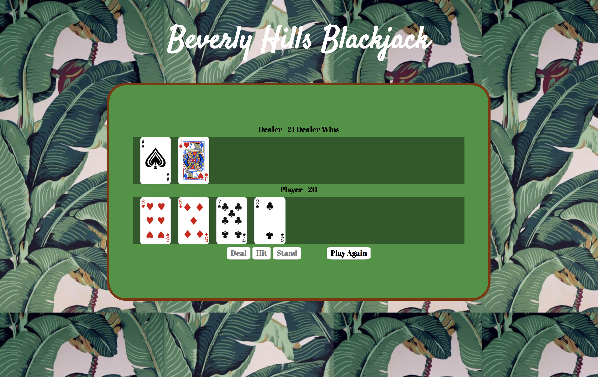

Beverly Hills Blackjack Game
============================

A game of blackjack to test:
- dom traversal and manipulation
- javascript implementation
- your luck

## Getting Started

This is a web browser game. Go ahead and open it up in your browser to see it in action!
Are you feeling lucky?

## Built With

* HTML
* Cascading Style Sheets
* Javascript
* Lots of Coffee

## Versions

there are two versions of the javascript file
- javascript1.0.js
- javascript2.0.js

1.0 is standard javascript dom manipulation
2.0 is javascript implemented with objects

They have essentially the same functionality with different motors under the hood.

## Future Features

- Betting system
- Card flip animations
- jQuery implementation

## Contributing

Feel free to fork the game and make some contributions

## Authors

* **Jesse Kent Weaver** - *Initial work* - [H0bbyist](https://github.com/H0bbyist)

## Acknowledgments

* Big thanks to all the great instructors at Digital Crafts!
